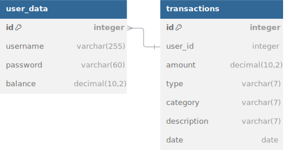

Perfect 👍 I’ll redesign it again with the **same clean style**, but this time I’ll **remove the license and author/contact details**.

Here’s the updated version:

---

# 💸 Expense Tracker App

### 📌 A desktop application for managing income & expenses with advanced reporting.

---

## 🚀 Features

* 🔐 **Secure Login & Registration** (Password encrypted with Jbcrypt)
* 💵 **Balance Overview** – View total balance, income, and expenses
* 📊 **Transaction Management**

  * Add, edit, delete transactions
  * Categorize by type (Expense/Income)
  * Store description & date
* 🗂 **Transaction History** – Organized cards with edit/delete options
* 📑 **Report Generation** – Export to **CSV, PDF, XLSX, TXT**
* 🔄 **Logout Anytime** – Switch accounts easily

---

## 🛠️ Tech Stack

* **Java (Swing)** – User Interface
* **MySQL** – Database
* **Jbcrypt** – Password Encryption
* **iText** – PDF Generation
* **Apache POI** – Excel Export

---

## 📂 Project Structure

```
src/
 └── com/expenseTracker/
      ├── backend/   # Database connectors, data utilities
      ├── frontend/  # GUI frames, panels, components
      ├── main/      # Entry point
      └── test/      # Unit tests
resources/assets/images   # Icons & images
lib/                      # External libraries
```

---

## 📜 Database Schema

<div align="center">
  
</div>

---

## ⚡ How to Run

1. Install **Java 8 or later**
2. Ensure **JDK (javac & java)** is properly configured
3. Place required libraries inside the `lib` folder
4. Run the application:

   ```bash
   javac -cp "lib/*" src/com/expenseTracker/main/Main.java
   java -cp "lib/*:src" com.expenseTracker.main.Main
   ```

---
